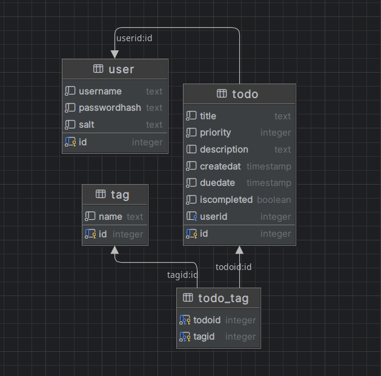

# Programming II, Technology II, Systems Development II pilot program 2024

- Server application development starts after the React + PostREST development the first weeks
- Server application uses a non-domain driven approach with hyper specialized models and endpoints (hyper-distinct from what postgREST offers and more in line with what most complex business cases require)
- Client application is as minimal as possible with most data manipulation and business logic happening on the server

## Data model:


## Quickstart with Docker Compose:
```bash
docker-compose up
```
## Quickstart "manually" with .NET CLI + vite

*(if you want to start the server app with another DB than local container, simply set an env variable PG_CONN with postgres connection string and set env variable SKIP_DB_CONTAINER_BUILDING to true)*

Start API on port 5000 (+ starts postgres DB in container on port 5432):
```bash
cd server-app/api && dotnet run
```

Start client:
```bash
cd client-app && npm run dev
```

